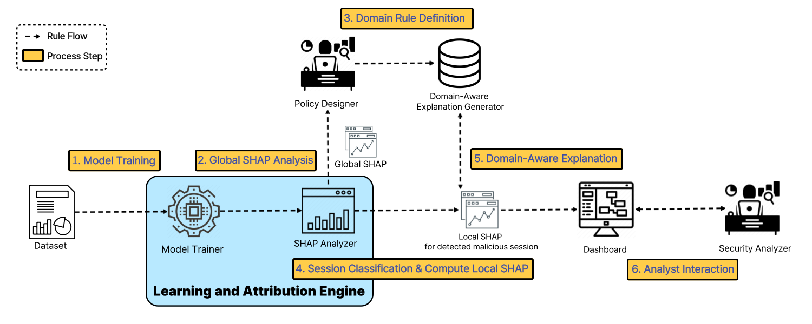

## Interpretable Detection of Encrypted Traffic Using SHAP-Based Feature Attribution

### Introduction

As encryption becomes ubiquitous in modern network communications, traditional intrusion detection systems (IDS) relying on payload inspection are losing effectiveness. To address this, machine learning (ML) techniques using flow-level statistical features—such as packet timing, sizes, and connection metadata—offer a promising alternative. However, the black-box nature of ML models hinders their adoption in practical security operations, where interpretability and trust are crucial.

This project proposes an end-to-end detection and explanation framework that combines high-performance encrypted traffic detection with human-understandable interpretations using **SHAP (SHapley Additive exPlanations)**. By applying both global and local SHAP analysis to a trained Random Forest classifier, we aim to provide actionable insights to both policy designers and security analysts.

Key contributions of this project include:
- Accurate detection of malicious encrypted traffic using flow-level ML models.
- SHAP-based global feature importance analysis for policy rule construction.
- Contextual local explanation generation through a domain-aware interpretation engine.
- Visualization of per-session predictions and explanations via an interactive dashboard.

### Features

- **Flow-based Encrypted Traffic Detection**: Uses ML models trained on flow-level features without requiring decryption.
- **Global and Local Interpretability**: SHAP analysis provides both overall and per-session explanations of model decisions.
- **Domain-Aware Explanation Engine**: Maps feature contributions to contextual security insights using predefined semantic rules.
- **Interactive Analyst Dashboard**: Displays SHAP visualizations with human-readable interpretations and recommended responses.
- **High Accuracy**: Achieves over 99% accuracy, precision, recall, and F1-score in detecting malicious encrypted sessions.

### Architecture



1. **Learning & Attribution Engine**
   - Trains a Random Forest classifier on encrypted traffic datasets.
   - Computes SHAP values to analyze feature contributions.

2. **Global SHAP Analysis**
   - Provides overall feature importance used by policy designers to define semantic rules.

3. **Domain Rule Definition**
   - Policy designers build rule sets that interpret SHAP-ranked features in a security context.

4. **Session Classification & Local SHAP Computation**
   - New sessions are classified; local SHAP values are computed for malicious sessions.

5. **Domain-Aware Explanation**
   - Matches local SHAP values to semantic rules and generates human-readable interpretations.

6. **Analyst Interaction**
   - Security analysts use a dashboard to inspect explanations and respond with informed decisions.


### Technologies Used

- **Programming Languages**: Python
- **Machine Learning Frameworks**: Scikit-learn, XGBoost
- **Explainability Toolkits**: SHAP
- **Data Handling**: Pandas, NumPy
- **Visualization**: Matplotlib, Seaborn, SHAP plots
- **Dataset**: [Encrypted Traffic Feature Dataset](https://data.mendeley.com/datasets/xw7r4tt54g/1)
- **Development Environment**: Jupyter Notebook, VS Code


### Installation and Steps to Test System
#### Prerequisites

1. Install **Python 3.8+** and `pip` (Python package manager).

2. (Recommended) Create and activate a virtual environment:
```bash
python3 -m venv venv
source venv/bin/activate
```

3. Install all required Python packages:
```bash
pip install -r requirements.txt
```
#### Steps
1. Download dataset:
```bash
wget https://prod-dcd-datasets-cache-zipfiles.s3.eu-west-1.amazonaws.com/xw7r4tt54g-1.zip
```

2. Run model training and SHAP analysis:
```bash
python3 session_rf_shap_analysis.py
```

3. Generate domain rule definition:
```bash
python3 feature_explanation_from_csv
```

4. Strat Dashboard
```bash
streamlit run dashboard.py
```
